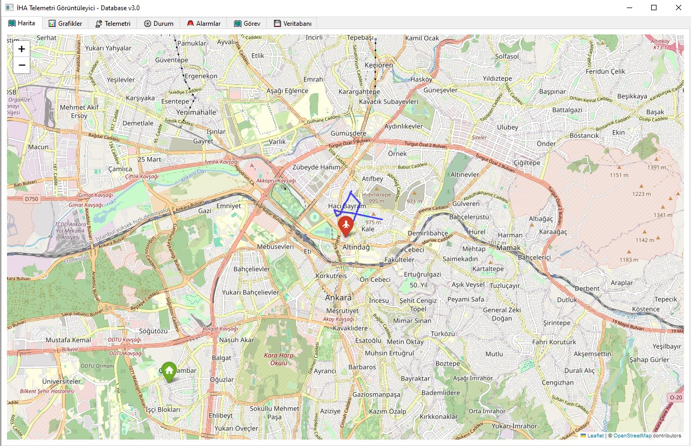
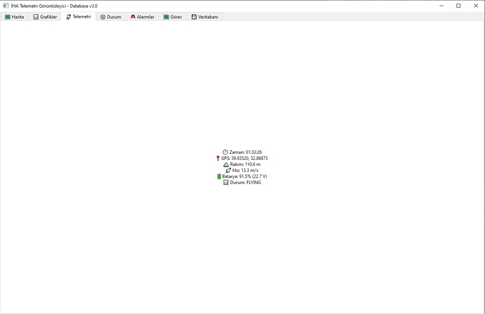
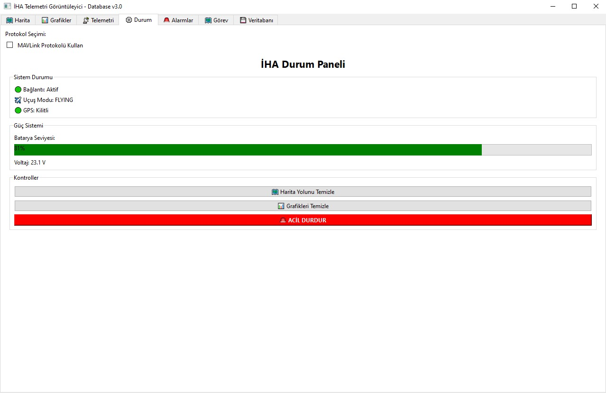
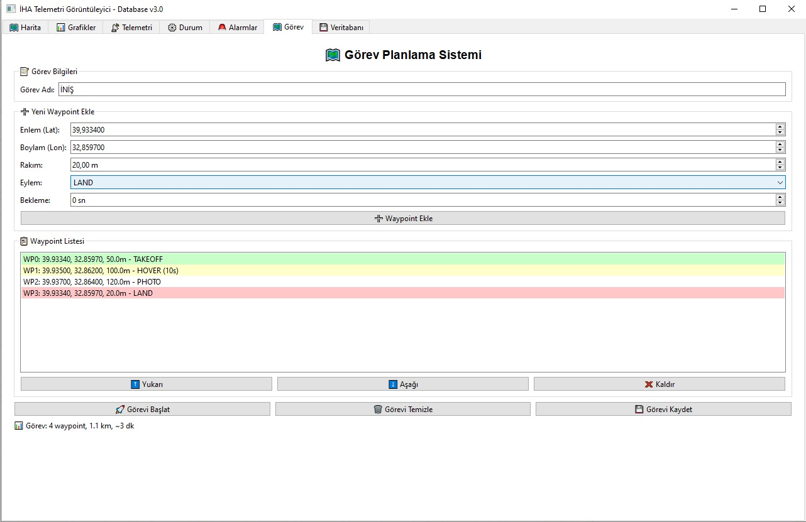
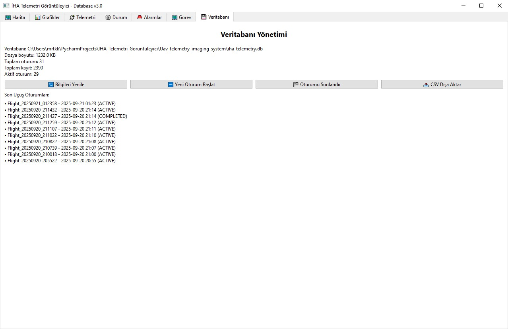

# UAV Telemetry Imaging System

## Project Overview
* Python/PySide6 based UAV telemetry visualization system
* Real-time data visualization and monitoring
* MAVLink protocol support
* Database integration with flight session management

## Features
* Real-time telemetry data display
* Interactive map-based flight tracking
* Comprehensive alarm and alert system
* Waypoint-based mission planning
* MAVLink protocol simulation and support
* SQLite database for flight data storage
* Exportable flight reports and data analysis

## Technical Architecture
* **Frontend**: PySide6 (Qt6) for modern GUI
* **Backend**: SQLAlchemy for database management
* **Protocols**: MAVLink for industry-standard communication
* **Visualization**: Folium for interactive maps, PyQtGraph for real-time charts
* **Data Models**: Pydantic for robust data validation

## Screenshots

### Main Interface - Map and Telemetry

*Real-time UAV position tracking and telemetry data visualization*

### General Telemetry Status

*Live telemetry data and system status monitoring*

### MAVLink Protocol Support

*MAVLink protocol selection and UAV status panel*

### Alarm System - Low Battery Warning
.jpg)
*Low battery warning system with visual indicators*

### Alarm System - Critical Battery Alert
.jpg)
*Critical battery alarm system for emergency situations*

### Mission Planning System

*Waypoint-based mission planning interface with route calculation*

### Database Management

*Flight session management and database administration panel*

## Installation & Setup

### Prerequisites
* Python 3.8 or higher
* Virtual environment (recommended)

### Installation Steps
```bash
# Clone the repository
git clone https://github.com/mrtkkr/UAV_telemetry_imaging_system.git
cd UAV_telemetry_imaging_system

# Create virtual environment
python -m venv venv
source venv/bin/activate  # On Windows: venv\Scripts\activate

# Install dependencies
pip install -r requirements.txt

# Run the application
python main.py

# Run telemetry system tests
python tests/test_telemetry.py

# Run UI component tests
python tests/test_ui.py

# Run all tests
python -m pytest tests/ -v
```

# Key Components
* SQLAlchemy-based ORM for data persistence
* Flight session tracking and management
* Telemetry data storage and retrieval
* Export capabilities for data analysis
## MAVLink Integration
* Industry-standard protocol implementation
* Simulated and real-time data support
* Message parsing and telemetry conversion
* Thread-safe communication handling
## User Interface
* Modern Qt6-based interface design
* Real-time data visualization
* Interactive mapping with flight path tracking
* Comprehensive alarm and notification system
## Mission Planning
* Waypoint-based flight planning
* Route calculation and optimization
* Mission export and import capabilities
* Real-time mission status monitoring
# Development & Contribution
## Code Quality
* Comprehensive unit test coverage
* PEP 8 compliant code styling
* Type hints and documentation
* Error handling and logging
## Architecture Principles
* Modular design with clear separation of concerns
* Event-driven architecture for real-time updates
* Thread-safe operations for concurrent processing
* Extensible plugin architecture for future enhancements
## License
This project is developed for educational and research purposes.
## Contact
For questions or collaboration opportunities, please reach out through the project repository.
